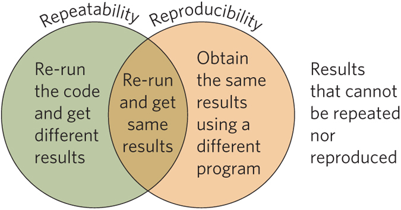

##
<div class="centered">
Abū ʿAlī al-Ḥasan ibn al-Ḥasan ibn al-Haytham (965 - 1040)

*Alhaze*n
</div>

## Reprodutibilidade
<div class="centered">
<br>
<br>
*sf (reprodutível+i+dade) Qualidade de reprodutível.*
</div>


## 
<div class="columns-2">
    
<br><br>- Cientistas devem replicar seus experimentos<br><br>
- Cientistas devem ser capazes de instruir outros pesquisadores a reproduzir seus experimentos<br><br>
- Estabelecer a reprodutibilidade do experimento é necessário para construir e testar teorias
</div>

## Estamos tornando nossas pesquisas reproduziveis? 

*Irreprodutibilidade na pesquisa custa entre 10 e 50 bilhões de dolares por ano* <br>
26% análise dos dados!! (Baker 2015)
<br>
<div class="centered">

http://www.nature.com/news/reproducibility-1.17552

## PIB
<div class="centered">


## Maior experimento de reprodutibilidade já feito..
<div class="columns-2">
    
De 100 experimentos replicados só 39 mantiveram as conclusões iguais...
<br><br><br><br>

</div>


##
<div class="centered">
    
</div>
<small> Steve M. Easterbrook. Open code for open science? Nature Geoscience 7, 779–781 (2014) doi:10.1038/ngeo2283.</small>

## Solução

- Descrever os protocolos do experimento ou coleta em "detalhes"
- Compartilhar os dados
- Compartilhar as análises do trabalho...
- 

## Como não compartilhar codigos...
```{r, eval = FALSE}
Shapetransformator1.0<-function(arquivo,grid=as.data.'frame(0)){
  if(!is.matrix(grid)){
  grid(data=arquivo)->grid}  
  Data<<-nrow(teste2@data);  a<<-table(grid)
  a1<<-length(a);   n<<-nrow(grid)
  linhas<<-as.vector(n-a[1])-(a[a1]-1);resu<-matrix(0,nrow=linhas,ncol=Data+2)
  for(i in 1:Data){
    dados<-arquivo@polygons[[i]]@Polygons[[1]]@coords
    res<-trabalho(dados,grid)
    if(i==1){resu[,1:3]<-res}
    else{resu[,i+2]<-res[,3]      
    }}
  nome1<-as.vector(arquivo@data[,1])
  nomes<-c("longitude","latitude",nome1)
  colnames(resu)<-nomes
  resu<-unicas(resu)
  resu[,1]<-resu[,1]/2;   resu[,2]<-resu[,2]/2
  return(resu)
}

```

## Broenimman et al 2012
```{r, eval = FALSE}
# if PROJ = F
row.w.1.occ<-1-(nrow(occ.sp1)/nrow(rbind(occ.sp1,occ.sp2))) # prevalence of occ1
row.w.2.occ<-1-(nrow(occ.sp2)/nrow(rbind(occ.sp1,occ.sp2))) # prevalence of occ2
row.w.occ<-c(rep(0, nrow(clim1)),rep(0, nrow(clim2)),]
rep(row.w.1.occ, nrow(occ.sp1)),rep(row.w.2.occ, nrow(occ.sp2)))

row.w.1.env<-1-(nrow(clim1)/nrow(clim12))  # prevalence of clim1
row.w.2.env<-1-(nrow(clim2)/nrow(clim12))  # prevalence of clim2
row.w.env<-c(rep(row.w.1.env, nrow(clim1)),
             rep(row.w.2.env, nrow(clim2)),rep(0, nrow(occ.sp1)),rep(0, nrow(occ.sp2)))

fac<-as.factor(c(rep(1, nrow(clim1)),rep(2, nrow(clim2)),
                 rep(1, nrow(occ.sp1)),rep(2, nrow(occ.sp2))))

# if PROJ = T

row.w.occ.PROJT<-c(rep(0, nrow(clim1)),rep(0, nrow(clim2)),rep(1, nrow(occ.sp1)),
                   rep(0, nrow(occ.sp2)))
row.w.env.PROJT<-c(rep(1, nrow(clim1)),rep(0, nrow(clim2)),rep(0, nrow(occ.sp1)),
                   rep(0, nrow(occ.sp2)))

```


## 
<div class="columns-2">
    
    
</div>

## 
<div class="columns-2">
    
    
</div>

## Como fazer isso?
<div class="centered">

</div>


## Boas práticas
- Deixe seus dados disponíveis em um formato e modo que todos possam ter acesso ou forneça o link para base de dados utilizadas (inclusive se isso foi obtido por meio de um codigo)
- Detalhe o seu código
- Utilize um estilo padrão no código (https://google-styleguide.googlecode.com/svn/trunk/Rguide.xml)
- Seja explícito sempre que uma decisão específica foi tomada (parâmetro, métrica, divisão dos dados...) 
- Forneça ao usuário um código flexível para que ele possa tomar suas próprias decisões
- Forneça ao usuário um código flexível para que ele possa usar os próprios dados

## Boas práticas
- Avise quando vai demorar ou precisar de muita memoria.
- DRY (Don't Repeat Yourself!) seu código 
- Não omita nada...
- Não complique!
- Teste seu código
- Peça para alguém testar seu código

## Compartilhe o resultado!
<div class="centered">

</div>
